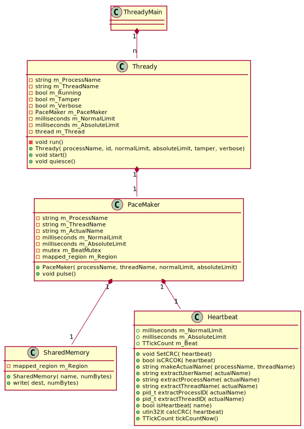
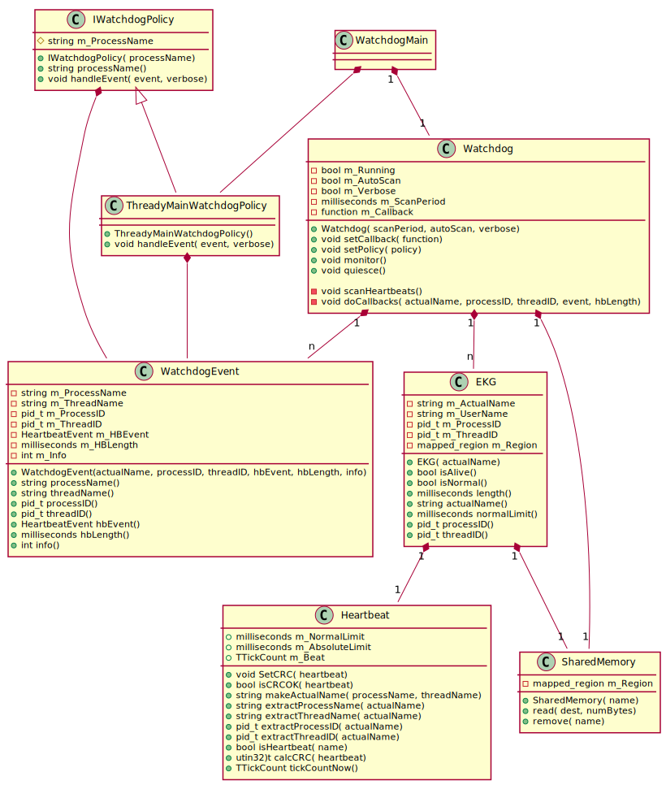

# Watchdog

C++98/Boost Watchdog classes Using Shared Memory

There are two sample applications:

* WatchdogMain - an example implementation of a watchdog
* ThreadyMain - a client of the watchdog

### ThreadyMain

This test application creates a specified number of threads using the Thready sample class,
each with their own heartbeat, managed via the PaceMaker class.
It specifies "normal" and "fatal" heartbeat ranges of 500msec and 1 sec respectively.
A command-line option exists to vary the pulse rate in each thread randomly,
which will occasionally trigger events in the watchdog.

### WatchdogMain

This test application uses the Watchdog class to manage heartbeats stored in shared memory.
The Watchdog class scans shared memory for heartbeats and monitors each one for timeliness.
It uses an instance of the EKG class to monitor a single heartbeat.

The WatchdogMain application has a global callback which will receive events for all applications.
In addition to this, the ThreadyMainWatchdogPolicy class also has a callback just for its events.

### How To Use

1. Build both applications with the provided cmake script.
2. In a terminal window, start ThreadyMain.
   * to see heartbeat activity in the terminal
   * -n <#threads> - the default is 20
   * optionally use the -t option to introduce variability in the heartbeat rates 
3. In a second terminal window, start WatchdogMain
   * you will need the -v option to see Watchdog activity
4. In a third terminal window, examine shared memory
   * cd /dev/shm
   * watch ls
5. Optionally run htop in another terminal to see impact of both programs on CPU loads.
6. If ThreadyMain is terminated, or if heartbeat anomalies occur in individual threads, WatchdogMain should output events.
