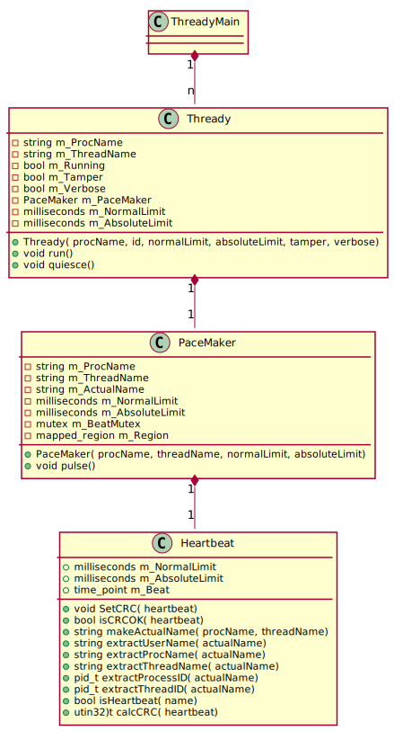
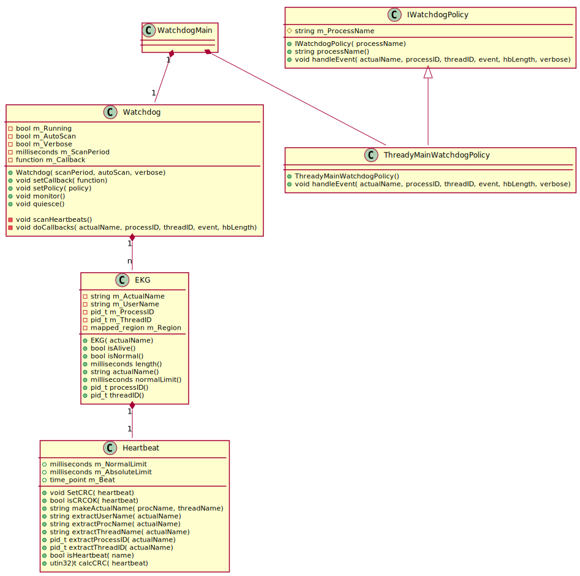

# Watchdog
C++98/Boost Watchdog classes Using Shared Memory

There are two sample applications:
* WatchdogMain - an example implementation of a watchdog
* ThreadyMain - a client of the watchdog

### ThreadyMain
This test application creates a specified number of threads using the Thready sample class,
each with their own heartbeat, managed via the PaceMaker class.
It specifies "normal" and "fatal" heartbeat ranges of 500msec and 1 sec respectively.
A command-line option exists to vary the pulse rate in each thread randomly,
which will occasionally trigger events in the watchdog.

<!--
@startuml
class ThreadyMain
class Thready {
-string m_ProcName
-string m_ThreadName
-bool m_Running
-bool m_Tamper
-bool m_Verbose
-PaceMaker m_PaceMaker
-milliseconds m_NormalLimit
-milliseconds m_AbsoluteLimit

+Thready( procName, id, normalLimit, absoluteLimit, tamper, verbose)
+void run()
+void quiesce()
}
class PaceMaker {
-string m_ProcName
-string m_ThreadName
-string m_ActualName
-milliseconds m_NormalLimit
-milliseconds m_AbsoluteLimit
-mutex m_BeatMutex
-mapped_region m_Region

+PaceMaker( procName, threadName, normalLimit, absoluteLimit)
+void pulse()
}
class Heartbeat {
+milliseconds m_NormalLimit
+milliseconds m_AbsoluteLimit
+TTickCount m_Beat

+void SetCRC( heartbeat)
+bool isCRCOK( heartbeat)
+string makeActualName( procName, threadName)
+string extractUserName( actualName)
+string extractProcName( actualName)
+string extractThreadName( actualName)
+pid_t extractProcessID( actualName)
+pid_t extractThreadID( actualName)
+bool isHeartbeat( name)
+utin32)t calcCRC( heartbeat)
+TTickCount tickCountNow()
}
ThreadyMain "1" *-- "n" Thready
Thready "1" *-- "1" PaceMaker
PaceMaker "1" *-- "1" Heartbeat
@enduml

-->

### WatchdogMain
This test application uses the Watchdog class to manage heartbeats stored in shared memory.
The Watchdog class scans shared memory for heartbeats and monitors each one for timeliness.
It uses an instance of the EKG class to monitor a single heartbeat.

The WatchdogMain application has a global callback which will receive events for all applications.
In addition to this, the ThreadyMainWatchdogPolicy class also has a callback just for its events.

<!--
@startuml
class WatchdogMain

class Watchdog {
-bool m_Running
-bool m_AutoScan
-bool m_Verbose
-milliseconds m_ScanPeriod
-function m_Callback

+Watchdog( scanPeriod, autoScan, verbose)
+void setCallback( function)
+void setPolicy( policy)
+void monitor()
+void quiesce()

-void scanHeartbeats()
-void doCallbacks( actualName, processID, threadID, event, hbLength)
}

class IWatchdogPolicy {
#string m_ProcessName
+IWatchdogPolicy( processName)
+string processName()
+void handleEvent( actualName, processID, threadID, event, hbLength, verbose)
}

class ThreadyMainWatchdogPolicy {
+ThreadyMainWatchdogPolicy()
+void handleEvent( actualName, processID, threadID, event, hbLength, verbose)
}

class EKG {
-string m_ActualName
-string m_UserName
-pid_t m_ProcessID
-pid_t m_ThreadID
-mapped_region m_Region

+EKG( actualName)
+bool isAlive()
+bool isNormal()
+milliseconds length()
+string actualName()
+milliseconds normalLimit()
+pid_t processID()
+pid_t threadID()
}

class Heartbeat {
+milliseconds m_NormalLimit
+milliseconds m_AbsoluteLimit
+TTickCount m_Beat

+void SetCRC( heartbeat)
+bool isCRCOK( heartbeat)
+string makeActualName( procName, threadName)
+string extractUserName( actualName)
+string extractProcName( actualName)
+string extractThreadName( actualName)
+pid_t extractProcessID( actualName)
+pid_t extractThreadID( actualName)
+bool isHeartbeat( name)
+utin32)t calcCRC( heartbeat)
+TTickCount tickCountNow()
}
WatchdogMain "1" *-- "1" Watchdog
Watchdog "1" *-- "n" EKG
EKG "1" *-- "1" Heartbeat
IWatchdogPolicy <|-- ThreadyMainWatchdogPolicy
WatchdogMain *-- ThreadyMainWatchdogPolicy
@enduml
-->

### How To Use

1. Build both applications with the provided cmake script.
2. In either order:
   1. In a terminal window, start ThreadyMain (verbose recommended).
   2. In a separate terminal window, start Watchdog (verbose recommended)
3. Examine shared memory (/dev/shm) to see ThreadyMain's heartbeats
4. If ThreadyMain is terminated, Watchdog should output events.
5. Examine both applications Usage for other options 